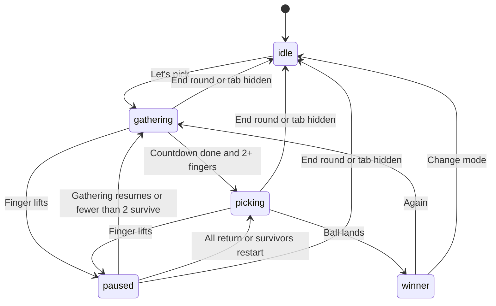

# Architecture and enhancement guide

## Stack

A client-only React application built with Vite and TypeScript. Canvas draws the live board. DOM elements provide controls and accessible status. Pointer Events feed touch positions into an independent engine. Web Audio synthesizes short effects. Tailwind supplies the existing UI primitives; app-specific visual styles live in one CSS file.

## Source map

| File | Responsibility |
| --- | --- |
| `index.html` | Document metadata, viewport, favicon, and app entry |
| `main.tsx` | React root and shared stylesheet |
| `app/page.tsx` | Mode selection, controls, pointer handling, canvas lifecycle, practice mode |
| `app/globals.css` | Theme, responsive layouts, and interaction states |
| `lib/game/engine.ts` | Participants, phases, timing, physics, landing, and public snapshots |
| `lib/game/identity.ts` | Accessible palette and the unique symbol paired with each color |
| `lib/game/random.ts` | Uniform cryptographic integer selection through rejection sampling |
| `lib/game/renderer.ts` | Glowing rings, external numbers and symbols, return timers, ball, trails, and winner particles |
| `lib/game/audio.ts` | Audio unlocking, sound toggle, and synthesized effects |
| `lib/game/webmcp.ts` | Optional browser agent tools, feature-detected and nonessential |
| `components/ui/radio-group.tsx` | Existing accessible mode-selection primitive |
| `components/ui/dialog.tsx` | Existing accessible help-dialog primitive |
| `public/favicon.svg` | App-specific icon |
| `tests/engine.test.ts` | Behavioral tests for the engine and optional tool contracts |
| `scripts/test-engine.mjs` | Compile the pure engine tests and run Node's test runner |
| `vite.config.ts` | React, alias resolution, development server, static production build |

The app does not need routing, authentication, a backend, or a global state library. Some starter toolkit files and dependencies are retained for future enhancements but are not used by the game.

## Ownership of state

`PickerEngine` is the source of truth. It accepts `start`, `join`, `move`, `release`, `resize`, `advance`, and `reset`. It does not import React or Canvas. Random selection and sound callbacks are injected so tests can use repeatable draws and capture effect events.

The browser calls `advance(performance.now())` from `requestAnimationFrame`. Canvas reads the engine directly each frame. React receives a cloned snapshot at roughly 12 updates per second and immediately after key controls. The engine's public snapshot intentionally hides the chosen Random Pick winner until the result is revealed.

Pointers are tracked by browser pointer ID while they are down. Participant IDs, colors, and symbols remain stable when a returned touch receives a different pointer ID. New participants take the first vacant entry in `PLAYER_STYLES`; this avoids duplicate live styles after an earlier participant expires. Pointer capture keeps movement associated with the play area, and `touch-action: none` prevents ordinary page gestures on the board. `pointercancel` uses the same missing-finger path as a release.

## State transitions

Grace deadlines use monotonic timestamps, independent of the paused gathering or picking elapsed time. The app resets unfinished rounds on tab hiding because background timers and touch streams may be suspended by browsers.

## Random Pick

At the start of picking, `randomIndex(participantCount)` selects one participant. It reads 32-bit words from `crypto.getRandomValues`, rejects words outside an exact multiple of the count, and then applies modulo. Thus each index gets the same number of possible accepted values.

Animation choices use separate random draws. The ball visits live finger coordinates, gradually slows, and makes a final eased approach to the selected ring. Moving a ring changes its drawing position and route but never redraws the winner. A grace-period return preserves the selection. An expired contact removes that participant and restarts selection among survivors.

This is ordinary local randomness, not a verifiable multiplayer lottery. The game does not claim tamper resistance against someone modifying the application itself.

## Pinball Play

The launch aims toward a randomly chosen initial bumper. During the first 5.8 seconds, the ball moves with a decreasing speed, reflects from board walls, and collides with circular finger bumpers. The simulation uses up to 8-millisecond substeps to reduce missed collisions. Recent finger velocity contributes an impulse, so sliding a finger changes the outgoing direction.

At the start of the final 1.2-second approach, `predictLanding` scores participants using alignment with current ball velocity, distance, and the last collision. It locks a final target and follows that ring's live position to its rim. This controlled finish guarantees the ball never stops without selecting someone. It also means movement can influence the result during active bouncing, but the target stays fixed once the final approach begins. Pinball does not promise equal odds or full rigid-body realism.

The approach lands one ring-radius plus one ball-radius from the finger center. Movement during a final approach updates the landing point. Lifting still pauses and follows the same grace rules.

## Rendering and performance

The same Canvas stays mounted when setup changes to play. Its parent changes from a small preview to a fixed, inset-zero stage with `100dvh` height and a `100vh` fallback. No setup panel consumes active play space. Controls use absolute positioning and safe-area offsets. Noninteractive overlays pass pointer events through to the Canvas. Body scrolling is locked only while a round is active; the theme-color metadata follows the light setup and dark game backgrounds.

The Canvas is absolutely positioned inside its measured parent to avoid intrinsic-size feedback during high-DPI resizing. `ResizeObserver` sets the backing buffer and logical engine dimensions, and the pointer adapter synchronizes dimensions before handling a contact if layout changed first. Device pixel ratio is capped at two to balance sharpness and glow cost. Logical coordinates stay in CSS pixels; resizing recalculates capacity and proportionally scales participant positions, the ball, and any pending final-approach origin. A revealed winner remains selected and its ball is repositioned on that ring's rim.

`identity.ts` owns the palette and `PlayerSymbol` type. The Canvas renderer draws opaque numbers and filled/stroked symbols beside each ring, trying alternate positions near edges or other participants. Those labels remain opaque even when a nonwinning ring dims. The winner's number and symbol also appear in the DOM result. See `docs/DESIGN.md` before changing identity or layout.

Decorative trails keep only 18 points. The scene contains a small set of rings and one ball, making a dedicated game framework or WebAssembly engine unnecessary for the first version. If profiling finds physics to be a bottleneck after substantial expansion, replace or wrap the engine while keeping the pointer adapter, controls, audio events, and renderer contracts.

## Audio

One `GameAudio` instance lazily creates an AudioContext from Start or another user gesture. Each effect creates short oscillator/gain nodes with a bounded envelope, disconnects them when finished, and respects the sound preference. There are no remote audio assets. Closing the component disposes the context.

## Practice input

Practice seeds up to six contacts with synthetic pointer IDs after the Canvas has expanded to the viewport. The actual count is limited by engine capacity and admission spacing. A round token prevents a scheduled practice callback from seeding a round that was reset or replaced. Mouse/touch dragging calls the same engine `move` method. Practice releases require the explicit **Lift NN** button; releasing a mouse drag keeps the simulated finger registered. Clicking a missing ring calls the same `join` method used for real returns.

## Optional agent tools

Where `document.modelContext.registerTool` exists, the app registers `read_picker_state` and `reset_picker_round`. Both validate an empty-object input schema and share the live engine. Reset clears a round and returns to setup; reading does not expose an unrevealed winner. Registration uses an AbortSignal and cleans up on unmount. Unsupported browsers ignore this optional enhancement.

## Common enhancement points

- **Adjust timings:** change `RULES` in `engine.ts`, then update visible copy and documentation. If making timings configurable, pass validated settings into the engine instead of changing globals during an active round.
- **Tune touch spacing:** adjust `minSpacing`, `ringRadius`, and edge admission together. Verify on actual screens.
- **Change colors and glow:** edit `PLAYER_STYLES` in `identity.ts`, the Canvas renderer, and CSS theme tokens. Keep unique symbols and opaque numbers independent of color, and check contrast against the board.
- **Change layout:** preserve the single mounted Canvas, full-viewport stage, scroll cleanup, pointer-event passthrough, and safe-area offsets. Verify portrait, landscape, and browser-bar height changes.
- **Add sound choices:** extend `GameAudio`; keep unlocking and muting centralized.
- **Change pinball behavior:** keep collision calculations separate from selection and final landing. Document whether changes affect odds.
- **Add Wasm:** define an input/output interface around simulation steps and benchmark before replacing the current engine. React and browser input/audio integration can remain unchanged.
- **Add install/offline support:** add a manifest and service worker as an explicit feature. This version deliberately has no offline cache to manage.

Preserve the deterministic test hooks, independent grace deadlines, stable revealed result, and mode locking while extending the app.
